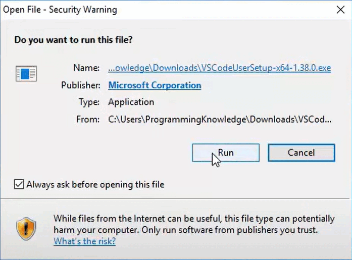
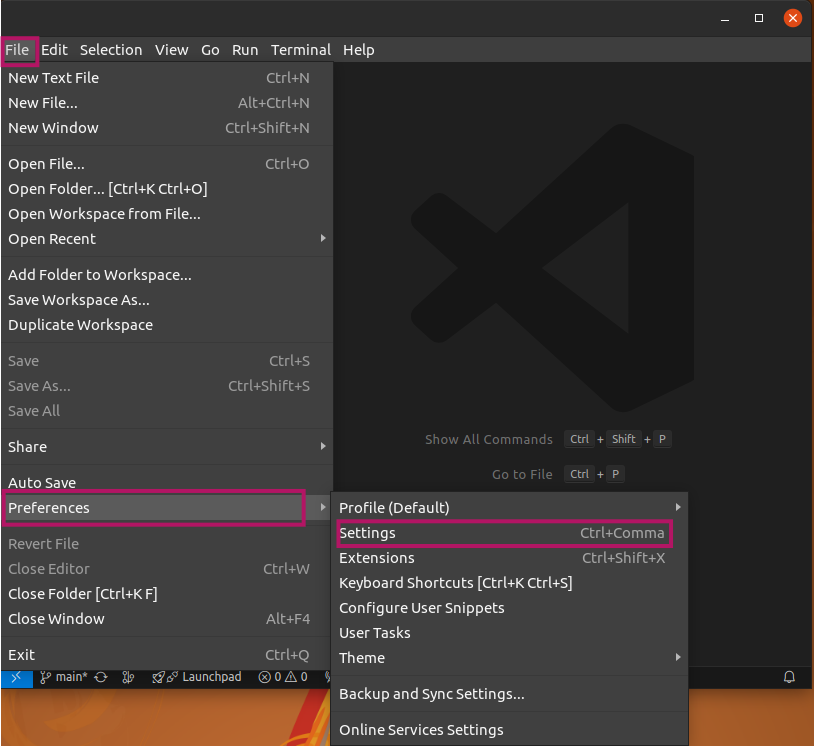
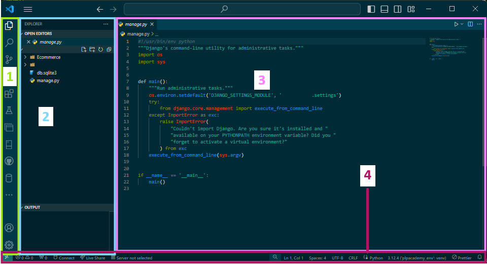
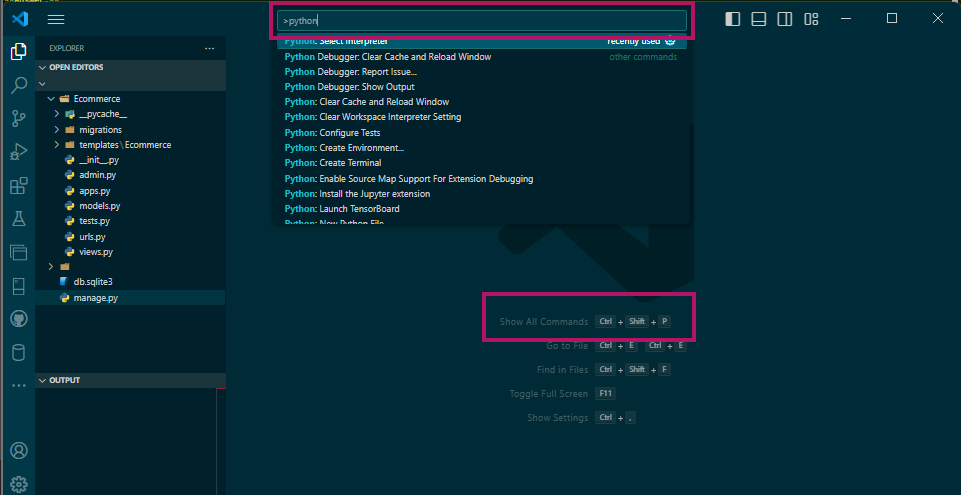
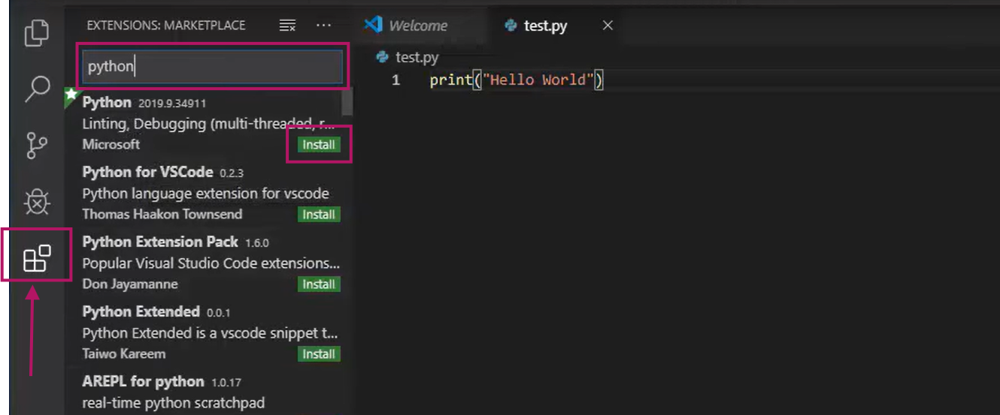
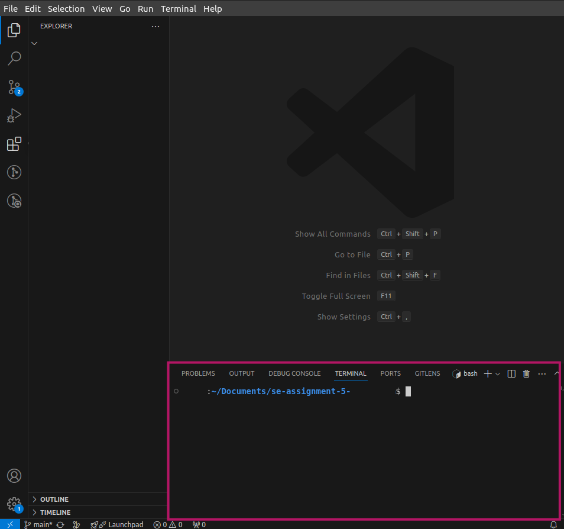
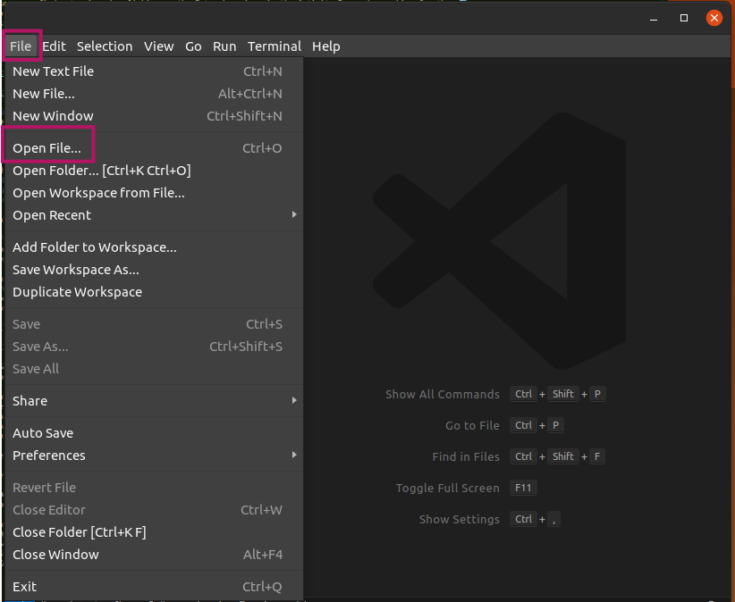
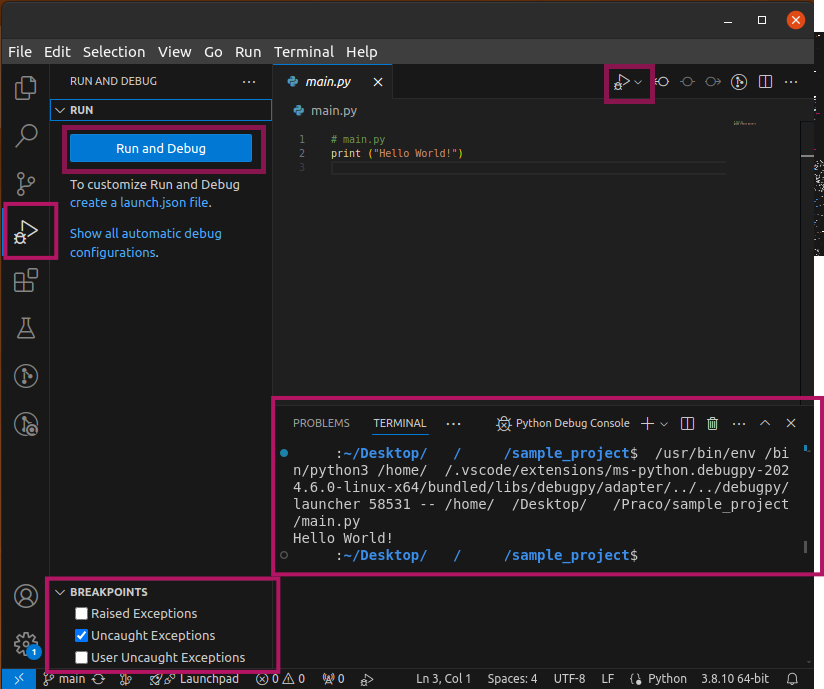
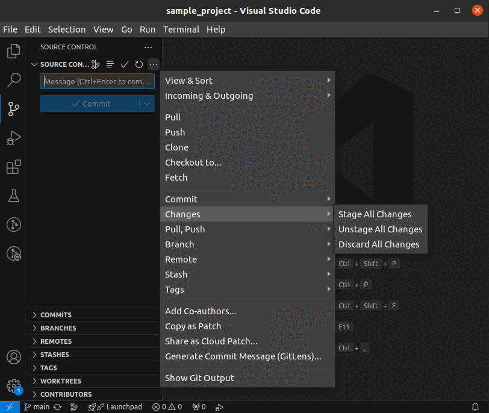

# Installation and Navigation of Visual Studio Code (VS Code)

## Installation of VS Code
**Question:** Describe the steps to download and install Visual Studio Code on Windows 11 operating system. Include any prerequisites that might be needed.

**Answer:**
1. Go to the official [Visual Studio Code download page](https://code.visualstudio.com/Download) 🌐.
2. Click on the Windows download button.
3. Once the download is complete, open the installer 📥.
4. Follow the prompts in the installer to complete the installation 🛠️.
   - Prerequisites: Windows 11 should be updated to the latest version.

 <!-- Add GIF demonstrating the installation process -->

## First-time Setup
**Question:** After installing VS Code, what initial configurations and settings should be adjusted for an optimal coding environment? Mention any important settings or extensions.

**Answer:**
1. Open VS Code.
2. Configure the settings by going to `File > Preferences > Settings` ⚙️.
   - Set the theme: `Color Theme > Dark+` 🌑.
   - Adjust the font size: `Editor: Font Size > 14` 🔤.
   - Configure auto-save: `Files: Auto Save > afterDelay` 💾.
3. Install essential extensions:
   - Python 🐍.
   - ESLint 📝.
   - Prettier ✨.

## User Interface Overview
**Question:** Explain the main components of the VS Code user interface. Identify and describe the purpose of the Activity Bar, Side Bar, Editor Group, and Status Bar.

**Answer:**
- **Activity Bar:** Contains icons for common actions like Explorer, Search, Source Control, and Extensions 📑.
- **Side Bar:** Shows different views like file explorer, search results, source control changes, etc. 🗂️.
- **Editor Group:** The main area where files are opened and edited 📝.
- **Status Bar:** Displays information about the current file and coding environment 📊.

## Command Palette
**Question:** What is the Command Palette in VS Code, and how can it be accessed? Provide examples of common tasks that can be performed using the Command Palette.

**Answer:**
- The Command Palette provides access to all available commands and is accessed by pressing `Ctrl+Shift+P` 🎨.
- Examples of tasks:
  - Opening files: `File: Open File` 📂.
  - Changing themes: `Preferences: Color Theme` 🌈.
  - Running tasks: `Tasks: Run Task` 🏃.

## Extensions in VS Code
**Question:** Discuss the role of extensions in VS Code. How can users find, install, and manage extensions? Provide examples of essential extensions for web development.

**Answer:**
- Extensions enhance functionality and add features to VS Code 🔌.
- Users can find extensions by clicking on the Extensions icon in the Activity Bar and searching for them 🔍.
- To install an extension, click the Install button next to the desired extension ⬇️.
- Essential extensions for web development:
  - Python 
  - Flutter 
  - SQLTools 

## Integrated Terminal
**Question:** Describe how to open and use the integrated terminal in VS Code. What are the advantages of using the integrated terminal compared to an external terminal?

**Answer:**
- Open the integrated terminal by pressing `Ctrl+`` (backtick) 💻.
- Advantages:
  - Direct access to terminal commands without leaving the editor 🖥️.
  - Multiple terminal instances 🖥️🖥️.
  - Consistent environment across different projects 🔄.

## File and Folder Management
**Question:** Explain how to create, open, and manage files and folders in VS Code. How can users navigate between different files and directories efficiently?

**Answer:**
- Create new files/folders via the Explorer pane or using `File > New File`/`New Folder` 📁.
- Open files with `File > Open File` or by dragging and dropping into the editor 🗂️.
- Navigate using the Explorer, Command Palette, or `Ctrl+P` to quickly open files 🔍.

## Settings and Preferences
**Question:** Where can users find and customize settings in VS Code? Provide examples of how to change the theme, font size, and keybindings.

**Answer:**
- Settings can be accessed via `File > Preferences > Settings` or `Ctrl+,` ⚙️.
- Change theme: `Preferences: Color Theme` 🎨.
- Change font size: `Editor: Font Size` 🔤.
- Customize keybindings: `File > Preferences > Keyboard Shortcuts` ⌨️.

## Debugging in VS Code
**Question:** Outline the steps to set up and start debugging a simple program in VS Code. What are some key debugging features available in VS Code?

**Answer:**
1. Open the program file 🗂️.
2. Set breakpoints by clicking in the gutter 🚦.
3. Start debugging with `Run > Start Debugging` or `F5` 🐛.
4. Key features:
   - Watch expressions 👀.
   - Call stack 📜.
   - Variables view 🧮.
   - Step over/into/out controls 🕹️.

## Using Source Control
**Question:** How can users integrate Git with VS Code for version control? Describe the process of initializing a repository, making commits, and pushing changes to GitHub.

**Answer:**
1. Initialize a repository: `Source Control > Initialize Repository` 🔧.
2. Make changes and stage them: `Source Control > Stage Changes` 📥.
3. Commit changes: `Source Control > Commit` ✅.
4. Push to GitHub:
   - Set up remote: `git remote add origin <URL>` 🌐.
   - Push changes: `git push -u origin main` 🚀.

## References
- [Visual Studio Code Documentation](https://code.visualstudio.com/docs) 📚
- [GitHub Docs](https://docs.github.com/) 📖
